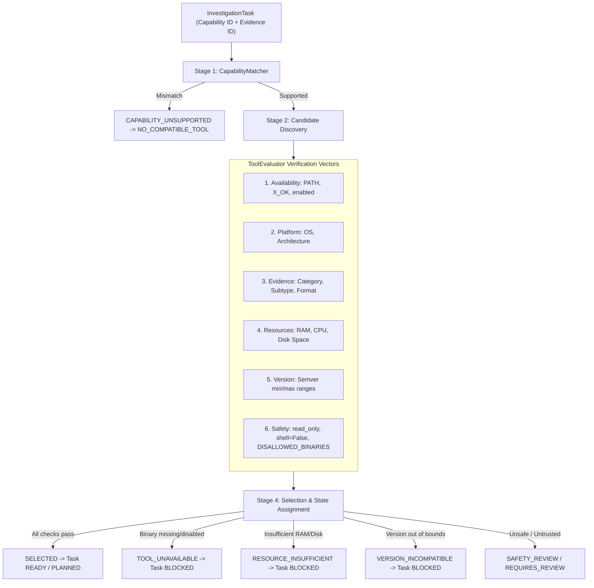

# ADFIR — Phase 2 / Step 7: Capability & Tool Selection Subsystem

## 1. Overview & Objective

The **Capability & Tool Selection Subsystem** bridges the gap between the high-level forensic requirements generated by the **Investigation Strategy Engine** (Step 6) and the concrete, local forensic executables registered in the host environment.

Given:
- **Case Objectives**
- **Evidence Intelligence Profiles** (format, architecture, platform, filesystem)
- **Forensic Capability Registry** (`ForensicCapability`)
- **Host Tool Registry** (`ToolDefinition` & `PlatformAwareToolRegistry`)
- **Live System Resource Limits** (RAM, CPU cores, scratch disk)

The engine deterministically verifies, matches, and selects the optimal forensic tool for each task in an `InvestigationPlan`.

> [!IMPORTANT]
> **Zero Forensic Execution**: In strict accordance with architecture invariants, this subsystem **evaluates and selects** tools, validates safety and versions, but **never executes** forensic analysis tools. Execution and scheduling are reserved for subsequent orchestration phases.

---

## 2. Multi-Stage Deterministic Verification Pipeline

Every task in an investigation plan undergoes a 6-dimension evaluation pipeline:

### 1. Capability Registry Match (`CapabilityMatcher`)
- Compares required capability against `EvidenceItem` and `EvidenceIntelligence` attributes (`category`, `subtype`, `detected_format`, `platform`).
- Fails with `CAPABILITY_UNSUPPORTED` if evidence attributes conflict with capability specifications.

### 2. Candidate Discovery & Multi-Vector Evaluation (`ToolEvaluator`)
For every candidate tool advertising the capability:
- **Availability**: Checks binary presence in system `PATH` and local project directories (`tools/bin`), verifies executable permissions (`os.X_OK`), and checks `enabled` flag.
  - States: `AVAILABLE`, `UNAVAILABLE`, `DISABLED`, `MISSING`, `INCOMPATIBLE`, `REQUIRES_REVIEW`.
- **Platform Compatibility**: Verifies host OS (`linux`, `windows`, `darwin`) against `tool.platforms`.
  - States: `COMPATIBLE`, `INCOMPATIBLE`.
- **Evidence Compatibility**: Verifies evidence format and category against `tool.supported_evidence` and `tool.supported_formats`.
  - States: `COMPATIBLE`, `INCOMPATIBLE`.
- **System Resources**: Queries live host capacity (RAM, CPU cores, scratch disk) via `get_system_resources()`.
  - Hard failure (`< 50%` of required): `RESOURCE_INSUFFICIENT`.
  - Warning/constrained (`50% - 100%` of required): `RESOURCE_CONSTRAINED`.
  - Sufficient (`>= 100%` of required): `RESOURCE_OK`.
- **Version Compatibility**: Evaluates semver ranges against `tool.min_version` and `tool.max_version`.
  - States: `VERSION_OK`, `VERSION_UNKNOWN`, `VERSION_INCOMPATIBLE`.
- **Safety Profile Enforcement**:
  - Enforces `read_only: True`.
  - Enforces `shell: False`.
  - Verifies binary is not in `DISALLOWED_BINARIES` (`bash`, `sh`, `cmd`, `powershell`, `python`, `sudo`, `su`, etc.).
  - Flags temporary directory paths as `REQUIRES_REVIEW`.

---

## 3. Database Schema & Models

### Migration `006_tool_selection_schema.py`

#### Table: `tool_selections` (`ToolSelectionRecord`)
| Column | Type | Description |
|---|---|---|
| `id` | String (UUID PK) | Unique selection record identifier |
| `plan_id` | String (FK `investigation_plans.id`) | Plan scope |
| `task_id` | String (FK `investigation_tasks.id`) | Task scope |
| `task_key` | String | e.g. `task-disk-01` |
| `capability_id` | String | e.g. `FILESYSTEM_ANALYSIS` |
| `evidence_id` | String (FK `evidence_items.id`) | Evidence scope |
| `candidate_tools` | JSON list | Evaluated candidate tool IDs |
| `selected_tool_id` | String (nullable) | ID of chosen tool if successful |
| `selection_status` | String | `SELECTED`, `NO_COMPATIBLE_TOOL`, `TOOL_UNAVAILABLE`, `RESOURCE_INSUFFICIENT`, `VERSION_INCOMPATIBLE`, `SAFETY_REVIEW`, `REQUIRES_REVIEW` |
| `availability_status` | String | Primary availability indicator |
| `evidence_compatibility` | String | `COMPATIBLE` / `INCOMPATIBLE` |
| `platform_compatibility` | String | `COMPATIBLE` / `INCOMPATIBLE` |
| `resource_status` | String | `RESOURCE_OK`, `RESOURCE_CONSTRAINED`, `RESOURCE_INSUFFICIENT` |
| `version_status` | String | `VERSION_OK`, `VERSION_UNKNOWN`, `VERSION_INCOMPATIBLE` |
| `safety_status` | String | `SAFE`, `UNSAFE`, `REQUIRES_REVIEW` |
| `rejection_reasons` | JSON dict | Structured rejection rationale for every evaluated candidate |
| `selection_rationale` | Text | Human-readable explanation of selection or failure |
| `created_at` | DateTime | UTC timestamp |

#### Extended Columns on `tool_definitions` (`ToolDefinition`)
- `display_name`
- `binary_name`
- `platforms`
- `supported_formats`
- `resource_requirements`
- `min_version`
- `max_version`
- `dependencies`
- `safety_profile`
- `enabled`

---

## 4. API Endpoints

| Method | Path | Summary | Authorization |
|---|---|---|---|
| `POST` | `/api/v1/investigation-plans/{plan_id}/select-tools` | Evaluates and selects tools for all tasks in a plan, updates task states, records audit events | Case RBAC (`OWNER`, `INVESTIGATOR`) |
| `GET` | `/api/v1/investigation-plans/{plan_id}/tool-selections` | Retrieves persisted tool selection records for an investigation plan | Case RBAC (`OWNER`, `INVESTIGATOR`, `VIEWER`) |
| `POST` | `/api/v1/strategy/validate-tool-match` | Dry-run validation of a capability against evidence and registered tools | Authenticated User |
| `GET` | `/api/v1/strategy/registries/validate` | Validates consistency of capability and tool registries (detects orphans, schema errors) | Authenticated User |

---

## 5. Verification & Test Suite

The test suite in [`backend/tests/test_tool_selection_subsystem.py`](file:///home/nandireddy/ADFIR/backend/tests/test_tool_selection_subsystem.py) covers all 14 required dimensions:
1. `test_capability_registry_match`: Validates capability match on compatible evidence attributes.
2. `test_evidence_type_compatibility_rejection`: Rejection of incompatible evidence types.
3. `test_tool_availability_detection`: Distinguishes `AVAILABLE`, `MISSING`, and `DISABLED` tools.
4. `test_platform_compatibility_check`: Rejection of tools unsupported on the current OS.
5. `test_resource_validation`: Distinguishes `RESOURCE_OK`, `RESOURCE_CONSTRAINED`, and `RESOURCE_INSUFFICIENT`.
6. `test_version_validation`: Semver evaluation for `min_version` and `max_version`.
7. `test_safety_profile_validation`: Rejection of write operations, shells, and disallowed binaries.
8. `test_incompatible_tool_rejection_recorded`: Structured rejection dictionary recording.
9. `test_unavailable_tool_handling`: Rejection without fake execution or crashes.
10. `test_multiple_candidate_tools_selection`: Deterministic candidate ranking based on format and resource profile.
11. `test_no_compatible_tool_task_blocked`: Sets task to `BLOCKED_NO_CAPABLE_TOOL` with rationale.
12. `test_registry_validation_service_and_api`: Orphan detection across capability and tool registries.
13. `test_step6_integration_and_plan_tool_selection`: End-to-end integration with Step 6 plan generation.
14. `test_case_authorization_and_idor_isolation`: Cross-case access restriction (403 Forbidden).
