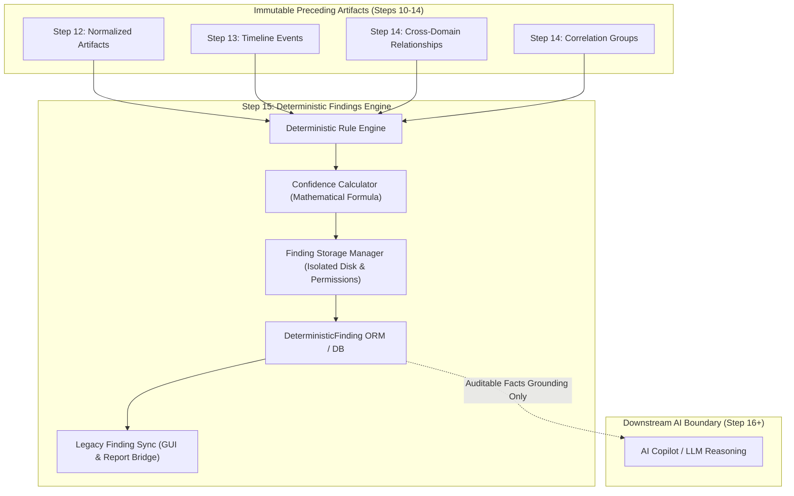

# ADFIR Phase 2 — Step 15: Deterministic Findings Subsystem

## 1. Executive Overview

The **Deterministic Findings Subsystem** implements Step 15 of the ADFIR forensic pipeline. It operates as the critical deterministic boundary between raw forensic correlation and downstream AI reasoning.

Prior to Step 15:
- **Step 10**: Preserved raw forensic outputs with SHA-256 hashes and immutable storage.
- **Step 11**: Extracted typed, normalized structured artifact records.
- **Step 12**: Converted structured records into unified normalized entities with deterministic identities.
- **Step 13**: Unified timestamped artifacts into an auditable UTC investigation timeline.
- **Step 14**: Correlated artifacts and events across forensic domains into relationships and clusters.

In Step 15, the **Deterministic Findings Subsystem** evaluates observable evidence facts from Steps 12–14 against auditable forensic rules to generate persistent findings before any AI copilot or LLM is permitted to reason about the case.

---

## 2. Core Architecture & Strict Forensic Boundaries



### Strict Invariant Boundaries
- **No LLM Reasoning**: Findings are generated strictly by deterministic rule evaluation in Python. Zero LLM calls are executed.
- **No Speculative Intent**: The engine never infers attacker intent, motives, or unobserved tactics (e.g., never declares "Adversary attempted lateral movement" or "Attacker goal achieved").
- **No Unsupported Attack Declarations**: Findings are restricted to observable facts (e.g., "Confirmed Malware Hash Match", "Process Linked to Outbound Socket").
- **Source Artifact Immutability**: Normalized artifacts, timeline events, relationships, and groups are strictly read-only and never modified.
- **Auditable Lineage**: Every finding retains an unbroken 7-tier provenance trace back to the physical disk image or memory dump.

---

## 3. Deterministic Evidence Rules & Severity Matrix

The subsystem implements 12 deterministic forensic rules. Severities are assigned strictly by documented evidence rules and explicit observable indicators:

| Severity Rule | Severity | Finding Type | Observable Evidence Condition |
| :--- | :--- | :--- | :--- |
| `RULE_CONFIRMED_MALWARE_HASH_MATCH` | `CRITICAL` | `MALWARE_INDICATOR` | `FILE_HASH_MATCH` relationship or artifact matching a cryptographic hash confirmed by an authoritative verified signature source (`signature_source`, `signature_identifier`, `signature_version`, `verification_status` in `VERIFIED`/`CONFIRMED`). |
| `RULE_PROCESS_NETWORK_OUTBOUND_SUSPICION` | `HIGH` | `SUSPICIOUS_EXECUTION` | `ArtifactRelationship` connecting process and an active network socket with an external remote IP **and** explicit evidence of suspicion (e.g. `is_suspicious=True`, interactive shell ports 4444/1337/31337/8888, anomalous path). |
| `RULE_MALWARE_SIGNATURE_HIT` | `MEDIUM` | `MALWARE_INDICATOR` | Heuristic YARA rule or signature pattern match (`MALWARE_MATCH`) without authoritative threat database confirmation (factual pattern observation, not confirmed malware). |
| `RULE_PRIVILEGED_USER_LOGON_ACTIVITY` | `MEDIUM` | `AUTHENTICATION_ACTIVITY` | Authentication record for administrative or system accounts (`SYSTEM`, `Administrator`, `root`, EventID `4672`). |
| `RULE_TEMPORAL_CROSS_DOMAIN_COINCIDENCE` | `MEDIUM` | `TEMPORAL_ANOMALY` | `ArtifactRelationship` of type `TEMPORAL_COINCIDENCE` between different domains with $\Delta t \le 5.0$ seconds. |
| `RULE_PROCESS_NETWORK_OUTBOUND_OBSERVATION` | `LOW` | `NETWORK_CONNECTION` | Factual observation of a process associated with an outbound network socket without explicit suspicious indicators. |
| `RULE_BROWSER_SOCKET_INTERACTION` | `LOW` | `NETWORK_CONNECTION` | Factual observation linking browser history or downloads to an active network endpoint. |
| `RULE_MULTI_DOMAIN_CORRELATED_CLUSTER` | `LOW` | `MULTI_DOMAIN_CORRELATION` | `ForensicCorrelationGroup` spanning $\ge 3$ distinct forensic domains (factual cluster observation without assuming malicious intent). |
| `RULE_USER_LOGON_OBSERVATION` | `LOW` | `AUTHENTICATION_ACTIVITY` | Standard user authentication record (non-privileged account). |
| `RULE_PROCESS_SOCKET_ASSOCIATION` | `INFORMATIONAL` | `NETWORK_CONNECTION` | `ArtifactRelationship` linking a process and network connection (PID match) on internal or loopback endpoints. |
| `RULE_TEMPORAL_SEQUENCE_OBSERVATION` | `INFORMATIONAL` | `TEMPORAL_ANOMALY` | `ArtifactRelationship` of type `TEMPORAL_SEQUENCE` within the same forensic domain. |
| `RULE_SHARED_FILE_HASH_OBSERVATION` | `INFORMATIONAL` | `GENERIC_EVIDENCE` | `ArtifactRelationship` of type `FILE_HASH_MATCH` where artifacts share a cryptographic hash without authoritative threat intelligence confirmation. |

---

## 4. Deterministic Confidence Calculation

The confidence score is computed purely through an auditable mathematical formula:

$$\text{Confidence} = 0.35 \times \text{source\_integrity} + 0.30 \times \text{artifact\_confidence} + 0.25 \times \text{identifier\_confidence} + 0.10 \times \min\left(1.0, \frac{\text{supporting\_sources}}{2}\right) - \text{penalty}$$

Where:
- $\text{source\_integrity} \in [0.0, 1.0]$: Cryptographic integrity state of underlying outputs and artifacts (1.0 if verified).
- $\text{artifact\_confidence} \in [0.0, 1.0]$: Confidence score of the contributing normalized artifacts and relationships.
- $\text{identifier\_confidence} \in [0.0, 1.0]$: Precision of matching identifiers (1.0 for SHA-256 hash or PID match, 0.90 for domain/URL, 0.85 for temporal proximity).
- $\text{supporting\_sources} \in \mathbb{N}$: Distinct evidence items or domains validating the finding.
- $\text{penalty} = 0.30$ if contradictory evidence is detected, $0.0$ otherwise.
- The score is clamped to $[0.0, 1.0]$ and rounded to 4 decimal places.

Every finding persists its exact input parameters in `confidence_inputs`:
```json
{
  "source_integrity": 1.0,
  "artifact_confidence": 0.95,
  "identifier_match_confidence": 1.0,
  "supporting_source_count": 2,
  "contradictory_evidence": false
}
```

---

## 5. Seven-Tier Traceable Provenance

Each deterministic finding maintains an unbroken 7-tier provenance chain tracing back to the original physical evidence:

```
[Tier 1: EvidenceItem]
       ↓ (Acquisition & Vault Checksum)
[Tier 2: ForensicExecution]
       ↓ (Validated Tool Execution & Environment)
[Tier 3: ExecutionOutput]
       ↓ (Raw Tool stdout/json & SHA-256)
[Tier 4: StructuredArtifact]
       ↓ (Typed Parser Extraction & Normalized Record)
[Tier 5: NormalizedArtifact]
       ↓ (Common Entity Identity & Deduplication)
[Tier 6: Timeline / Correlation]
       ↓ (UTC Unified Event & Cross-Domain Edge)
[Tier 7: DeterministicFinding]
```

When queried via `GET /cases/{case_id}/findings/{finding_id}/provenance`, the system returns hydrated lineage summaries for every contributing node across all tiers.

---

## 6. Cryptographic Integrity & Storage Security

- **Storage Location**: Findings are serialized to disk under:
  ```
  data/storage/findings/cases/{case_id}/{finding_id}.json
  ```
- **POSIX Permissions**: Directories are created with `0o700` (`rwx------`) and files with `0o600` (`rw-------`).
- **Path Traversal & Symlink Escapes**: All paths are resolved to their canonical form and validated to reside within the case directory. Symlink creation or traversal outside the case container raises a `PermissionError`.
- **Evidence Vault Isolation**: Writing into the read-only evidence vault (`data/evidence/vault`) is strictly blocked.
- **Tamper Detection**: Every finding computes a canonical SHA-256 hash of its core data fields (sorted keys, compact separators). Real-time verification detects in-memory database tampering, disk file modification, or file deletion.

---

## 7. REST API Endpoints

All endpoints require case-scoped JWT authentication and RBAC authorization (`get_authorized_case`):

| Method | Endpoint | Description |
| :--- | :--- | :--- |
| `POST` | `/api/v1/cases/{case_id}/findings/generate` | Generates deterministic findings from Steps 12–14 data. Supports filtering by `min_confidence` and `include_rules`. |
| `GET` | `/api/v1/cases/{case_id}/findings` | Lists findings with filters for `severity`, `finding_type`, `evidence_id`, `min_confidence`, and time range. |
| `GET` | `/api/v1/cases/{case_id}/findings/{id}` | Retrieves full finding record and observed facts. |
| `GET` | `/api/v1/cases/{case_id}/findings/{id}/supporting-evidence` | Returns hydrated contributing artifacts, timeline events, relationships, groups, and evidence items. |
| `GET` | `/api/v1/cases/{case_id}/findings/{id}/provenance` | Reconstructs the complete 7-tier lineage tree. |
| `GET` | `/api/v1/cases/{case_id}/findings/{id}/integrity` | Cryptographically verifies stored SHA-256 hash against live disk contents. |

---

## 8. Verification & Test Suite Summary

The subsystem is validated by a dedicated test suite with 100% pass rate:
- **Test File**: [`backend/tests/test_deterministic_findings_subsystem.py`](file:///home/nandireddy/ADFIR/backend/tests/test_deterministic_findings_subsystem.py) (16 tests, 0 failures).
- **Full Phase 2 Regression Suite**: 88/88 tests passed across Steps 10 through 15:
  - `test_raw_outputs_subsystem.py` (Step 10): 11 passed
  - `test_artifact_extraction_subsystem.py` (Step 11): 12 passed
  - `test_artifact_normalization_subsystem.py` (Step 12): 12 passed
  - `test_unified_timeline_subsystem.py` (Step 13): 12 passed
  - `test_cross_domain_correlation_subsystem.py` (Step 14): 15 passed
  - `test_deterministic_findings_subsystem.py` (Step 15): 16 passed
- **Frontend Build Status**: Clean build (`vite build` completed with exit code 0).
