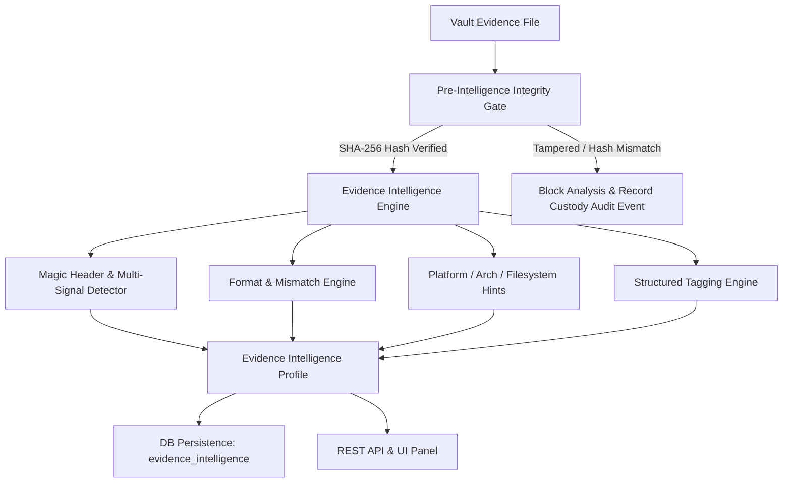

# ADFIR — Phase 2 / Step 5: Evidence Intelligence Subsystem Documentation

## 1. Overview & Architectural Boundaries

The **Evidence Intelligence Subsystem** is designed to inspect and determine the identity, file system structure, container format, and structural characteristics of preserved evidence artifacts *before* any forensic investigation, timeline reconstruction, or multi-agent execution takes place.

### Key Mandates & Non-Negotiables:
1. **Zero Evidence Mutation**: Original evidence items and files inside the immutable Vault remain byte-for-byte unmodified. Original SHA-256 hashes are strictly preserved.
2. **Pre-Intelligence Integrity Gate**: Prior to executing any structural inspection or magic signature profiling, the subsystem performs SHA-256 integrity re-validation against the preserved record. If the file is tampered, missing, or mismatched, analysis is strictly blocked, an `EVIDENCE_INTELLIGENCE_INTEGRITY_BLOCKED` chain-of-custody audit log event is recorded, and an `HTTP 422` exception is raised.
3. **No External AI Dependencies**: Intelligence extraction is purely deterministic, evidence-derived, non-destructive, auditable, and rule/heuristic based.
4. **Independent Analysis Stage**: Evidence Intelligence determines *what* the evidence is (e.g., PE32 executable, ext4 disk image, Windows Event Log) so downstream specialist forensic tools/agents (e.g., MalwareAgent, DiskAgent, LogAgent) can be routed with exact parameters.

---

## 2. Subsystem Architecture

---

## 3. Core Components

### 3.1 Intelligence Engine (`backend/app/services/intelligence.py`)
- **`verify_integrity_gate`**: Re-calculates SHA-256 on the stored vault file. Verifies presence and exact match. Logs chain-of-custody violations if mismatched.
- **`inspect_magic_header`**: Performs multi-signal binary header signature matching across PE, ELF, Mach-O, EVTX, SQLite, Registry (`regf`), Minidump (`MDMP`), PCAP/PCAPNG, E01, Raw/DD, VMDK, VHD, QCOW2, ZIP/7z/GZIP/RAR/XZ, PDF, PNG, JPEG.
- **`inspect_full_profile`**: Integrates classification, format mismatch assessment (`MATCH`, `MISMATCH`, `UNKNOWN`, `PARTIAL`), system hints (OS hint, architecture hint, filesystem hint, partition table hint), structured tagging, and recommended analysis tools.
- **`analyze_and_store_profile`**: Full lifecycle entry point that performs the integrity gate, runs profiling, persists or updates `EvidenceIntelligence` database model, and appends an `EVIDENCE_INTELLIGENCE_ANALYZED` chain-of-custody log.

### 3.2 Database Schema (`backend/app/models/models.py`)
- Table: `evidence_intelligence`
  - `id`: UUID (Primary Key)
  - `evidence_id`: Foreign Key (`evidence_items.id`, UNIQUE)
  - `classification`: String (e.g., `pe_executable`, `disk_image`, `windows_event_log`)
  - `subtype`: String (e.g., `pe32_x86_64`, `ext4_partition`, `evtx`)
  - `detected_format`: String
  - `confidence`: Float (0.0 to 1.0)
  - `format_mismatch`: String (`MATCH`, `MISMATCH`, `UNKNOWN`, `PARTIAL`)
  - `platform_hint`: String (`WINDOWS`, `LINUX`, `MACOS`, `UNKNOWN`)
  - `architecture_hint`: String (`x86`, `x86_64`, `ARM64`, `UNKNOWN`)
  - `filesystem_hint`: String (`NTFS`, `ext4`, `FAT32`, `exFAT`, etc.)
  - `partition_table_hint`: String (`MBR`, `GPT`, etc.)
  - `characteristics`: JSON List
  - `tags`: JSON List
  - `detection_signals`: JSON List
  - `recommended_tools`: JSON List
  - `analysis_timestamp`: DateTime
  - `schema_version`: String (`1.0.0`)

### 3.3 REST API Endpoints (`backend/app/api/v1/endpoints/evidence.py`)
- `GET /api/v1/evidence/{id}/intelligence`: Retrieves stored intelligence profile.
- `POST /api/v1/evidence/{id}/intelligence`: Trigger/create intelligence profile analysis.
- `POST /api/v1/evidence/{id}/intelligence/refresh`: Force re-analysis of intelligence profile.
- `GET /api/v1/evidence/{id}/intelligence/profile`: Endpoint for detailed profile view.
- `GET /api/v1/evidence/{id}/intelligence/tags`: Retrieves list of structured evidence tags.
- `GET /api/v1/cases/{case_id}/evidence/intelligence`: List intelligence profiles across an entire case.

---

## 4. Frontend Integration

- **`EvidenceDetail.tsx`**: Displays the **Evidence Intelligence Profile** panel including:
  - Classification & Detected Format badge
  - Red warning banner for Extension Mismatch (`MISMATCH`)
  - System Hints (Platform, Architecture, Filesystem, Partition Table)
  - Structured Evidence Tags (`EvidenceTag`)
  - Recommended Specialist Tools
  - Trigger / Re-run Intelligence Analysis button
- **`EvidenceList.tsx`**: Includes category filtering toolbar allowing investigators to filter evidence by type (`Disk Images`, `Memory`, `Windows`, `Linux`, `Event Logs`, `Network/PCAP`, `Browser/Database`, `Executables`).

---

## 5. Verification & Testing

Dedicated test suites verify all aspects of the Evidence Intelligence Subsystem:
- `backend/tests/test_evidence_intelligence_subsystem.py` (10 tests passing)
- `backend/tests/test_evidence_intelligence.py` (8 tests passing)
- Full backend regression: **299 / 299 tests passing**.

