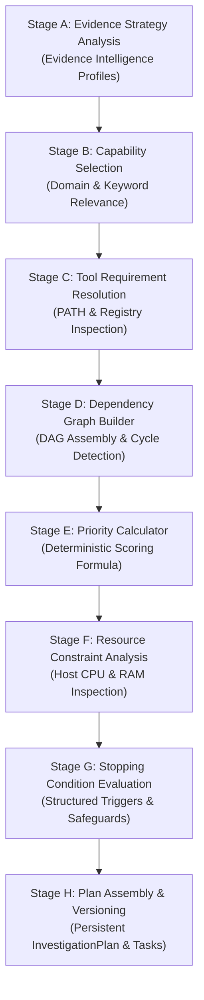

# ADFIR — Investigation Strategy Engine (Phase 2 / Step 6)

## 1. Subsystem Overview & Purpose

The **Investigation Strategy Engine** converts case parameters and evidence profiles into a deterministic, auditable, explainable, versioned, and DAG-structured **Investigation Plan**:

$$\text{Case Objective} + \text{Evidence Intelligence} + \text{Forensic Capabilities} + \text{Host Tools} + \text{Resource Constraints} \longrightarrow \text{Executable Investigation Plan}$$

### Strict Boundary Rules
- **Planning Only**: The Strategy Engine performs **NO forensic tool execution** (no binaries such as `fls`, `vol`, `yara`, `tshark`, or EVTX parsers are executed during this step).
- **No LLM Reasoning / No Agent Execution**: All capability selection, priority scoring, dependency mapping, and stopping condition evaluations are deterministic, formulaic, and explainable.
- **Evidence Integrity Gate**: Tampered or missing evidence files (`integrity_status != 'VERIFIED'`) strictly block downstream analysis tasks (`BLOCKED_INTEGRITY_FAILURE`).

---

## 2. Multi-Stage Deterministic Planning Architecture

### Stage A — Evidence Strategy Analysis (`EvidenceStrategyAnalyzer`)
- Inspects evidence category, subtype, detected format, platform hint, and filesystem.
- Maps evidence into core investigative domains:
  - `DISK_IMAGE` $\to$ `["DISK_STRUCTURE", "FILESYSTEM", "ARTIFACT_EXTRACTION", "TIMELINE"]`
  - `MEMORY_DUMP` $\to$ `["VOLATILE_MEMORY", "PROCESS_TREE", "NETWORK_CONNECTIONS", "INJECTION_SCAN"]`
  - `LOG` / `EVENT_LOG` $\to$ `["LOG_PARSING", "AUTHENTICATION_AUDIT", "TIMELINE", "CORRELATION"]`
  - `NETWORK_CAPTURE` $\to$ `["PCAP_ANALYSIS", "FLOW_EXTRACTION", "DNS_INSPECTION"]`
  - `SUSPICIOUS_FILE` / `PE_EXECUTABLE` $\to$ `["STATIC_ANALYSIS", "YARA_SCAN", "HEADER_PARSING"]`
- Checks `integrity_status` and `read_only_verified`; flags tampered evidence as invalid.

### Stage B — Capability Selection (`CapabilitySelector`)
- Queries registered `ForensicCapability` catalog (16 seeded forensic capabilities).
- Computes capability relevance based on evidence profile compatibility and case objective keywords (e.g. ransomware, exfiltration, persistence, memory injection).
- Stores explicit rationale for each capability selection.

### Stage C — Tool Requirement Resolution (`ToolRequirementResolver`)
- Evaluates candidate host tools using `shutil.which` and Python/Database tool registries.
- **Safety**: Inspects binary presence and executable permissions **without spawning execution processes**.
- When no compatible host tool is available, assigns status `BLOCKED_NO_CAPABLE_TOOL` with a clear explanation.

### Stage D — Dependency Graph & Topological Sorting (`DependencyGraphBuilder`)
- Assembles task-to-task relationships (e.g., Partition Analysis $\to$ Filesystem Analysis $\to$ Artifact Extraction $\to$ Timeline Analysis $\to$ Correlation).
- **Cycle Detection**: Uses 3-color Depth-First Search (DFS) to detect circular dependencies.
- **Topological Sorting**: Uses Kahn's algorithm (`in-degree` queue) to generate an acyclic execution order.

### Stage E — Priority Calculation Formula (`PriorityCalculator`)
Deterministic priority scoring ($0.0 \le \text{Score} \le 1.0$):

$$\text{Priority Score} = 0.35 \times \text{ObjRel} + 0.25 \times \text{EvConf} + 0.20 \times \text{DepPos} + 0.20 \times \text{CapImp}$$

- `CRITICAL`: $\text{Score} \ge 0.85$
- `HIGH`: $0.65 \le \text{Score} < 0.85$
- `MEDIUM`: $0.40 \le \text{Score} < 0.65$
- `LOW`: $\text{Score} < 0.40$
- `BLOCKED`: $0.0$ (Assigned when task is blocked by tool absence or integrity failure)

### Stage F — System Resource Constraint Analysis (`ResourceConstraintAnalyzer`)
- Inspects system CPU cores, host memory (RAM), and disk space using `psutil` (with graceful `os` fallback).
- Detects resource-constrained state ($\text{RAM} > 90\%$ or $\text{CPU} > 95\%$) to defer heavy forensic tasks.

### Stage G — Structured Stopping Conditions (`StoppingConditionEvaluator`)
Evaluates conditions determining plan termination or manual intervention:
1. `CRITICAL_INTEGRITY_FAILURE` (Critical — Requires human review)
2. `NO_COMPATIBLE_TOOL` (Warning — Requires human review)
3. `RESOURCE_LIMIT` (Warning — Automatic task deferral)
4. `NO_RELEVANT_CAPABILITIES` (Warning — Requires scope/evidence review)
5. `REQUIRED_ARTIFACTS_EXHAUSTED` (Info — Normal planning completion)

---

## 3. Plan Lifecycle, Review & Versioning

- **Immutable History**: Recalculating a strategy creates a new version (`v1` $\to$ `v2`) with `parent_plan_id` tracking previous iterations.
- **Safe Adjustments**: Automated review passes remove duplicate tasks and resolve missing prerequisites.
- **Task Statuses**: `PLANNED`, `READY`, `BLOCKED`, `DEFERRED`, `REQUIRES_REVIEW`.

---

## 4. REST API Specification

| Method | Endpoint | Description |
| :--- | :--- | :--- |
| `POST` | `/api/v1/cases/{case_id}/investigation-plans` | Generate deterministic plan for case |
| `GET` | `/api/v1/cases/{case_id}/investigation-plans` | List historical and active plan versions |
| `GET` | `/api/v1/investigation-plans/{plan_id}` | Get full plan metadata and snapshot |
| `GET` | `/api/v1/investigation-plans/{plan_id}/tasks` | Get ordered investigation tasks |
| `GET` | `/api/v1/investigation-plans/{plan_id}/graph` | Get DAG graph (nodes, edges, topological order) |
| `POST` | `/api/v1/investigation-plans/{plan_id}/review` | Perform validation review and safe adjustments |
| `POST` | `/api/v1/investigation-plans/{plan_id}/recalculate` | Re-analyze evidence and increment plan version |
| `GET` | `/api/v1/strategy/capabilities` | List registered forensic capabilities |
| `GET` | `/api/v1/strategy/tools` | Inspect host tool availability and registry health |

---

## 5. Database Schema & Migration

### Alembic Migration: `005_investigation_strategy_schema.py`
- Extended `investigation_plans` table: `parent_plan_id`, `validation_status`, `evidence_snapshot`, `resource_snapshot`, `stopping_conditions_summary`, `change_reason`, `created_by`.
- Created `forensic_capabilities` table: `id`, `name`, `description`, `domain`, `supported_evidence_types`, `required_inputs`, `expected_outputs`, `resource_profile`, `is_enabled`.
- Created `investigation_tasks` table: `id`, `plan_id`, `task_key`, `sequence`, `capability_id`, `agent_name`, `evidence_ids`, `candidate_tool_ids`, `selected_tool_id`, `priority_level`, `priority_score`, `priority_rationale`, `status`, `required_inputs`, `expected_outputs`, `resource_requirements`, `estimated_cost`, `rationale`, `blocking_reason`.
- Created `investigation_task_dependencies` table: `id`, `plan_id`, `parent_task_id`, `child_task_id`, `dependency_type`.
- Created `plan_stopping_conditions` table: `id`, `plan_id`, `condition_code`, `trigger_description`, `explanation`, `severity`, `human_review_required`.
- Created `plan_adjustments` table: `id`, `plan_id`, `adjustment_type`, `summary`, `previous_state`, `new_state`, `actor_id`.

---

## 6. Frontend Integration

- **Component**: [`InvestigationStrategyView.tsx`](file:///home/nandireddy/ADFIR/frontend/src/components/InvestigationStrategyView.tsx)
- **Integration**: Embedded directly into [`InvestigationProcessPage.tsx`](file:///home/nandireddy/ADFIR/frontend/src/pages/InvestigationProcessPage.tsx) with tab toggle between Strategy Planning and Execution.
- **Visual Features**:
  - Interactive DAG visualizer displaying prerequisite and dependent task edges.
  - Priority badge coloring (`CRITICAL`, `HIGH`, `MEDIUM`, `LOW`, `BLOCKED`).
  - Status indicators distinguishing `PLANNED`, `READY`, `BLOCKED`, `DEFERRED`, `REQUIRES_REVIEW`.
  - Host resource gauges (CPU cores, RAM available, concurrency limit).
  - Structured stopping condition alerts with human review triggers.
  - Plan review and recalculate triggers.

---

## 7. Verification & Test Suite Summary

- **Strategy Engine Dedicated Test Suite**: [`backend/tests/test_investigation_strategy_engine.py`](file:///home/nandireddy/ADFIR/backend/tests/test_investigation_strategy_engine.py) (20 tests, 100% pass).
- **Full Backend Regression**: 319 passed across 21 test suites in 20.26s.
- **Frontend TypeScript Build**: Clean compilation (`tsc -b && vite build` $\to$ 0 errors).
- **Tauri Rust Check**: Clean compilation (`cargo check` $\to$ 0 errors).
