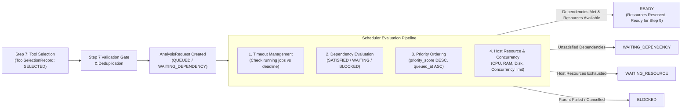

# ADFIR — Phase 2 / Step 8: Resource-Aware Scheduler Subsystem

## 1. Overview & Objective

The **Resource-Aware Scheduler** operates between **Step 7 (Capability & Tool Selection)** and future **Step 9 (Execution / Orchestration Engine)**.

Its fundamental responsibility is to prepare, validate, dependency-check, resource-check, priority-order, queue, and promote forensic analysis jobs to `READY`.

> [!IMPORTANT]
> **Strict Architectural Invariant: Zero Forensic Execution**
> The scheduler manages queue state, resource limits, dependencies, timeouts, and prioritization. It **DOES NOT** execute forensic binaries, spawn worker subprocesses, or kill OS processes. Execution is strictly reserved for Step 9.

---

## 2. Analysis Request Data Model & Lifecycle States

### Database Schema (`analysis_requests`)
The persistent model `AnalysisRequest` (Alembic migration `007_scheduler_schema.py`) tracks the complete lifecycle:

| Field | Type | Description |
|---|---|---|
| `id` | String (UUID PK) | Unique identifier of the analysis request |
| `case_id` | String (FK `cases.id`) | Enforces case boundary and RBAC |
| `plan_id` | String (FK `investigation_plans.id`) | Plan originating this request |
| `task_id` | String (FK `investigation_tasks.id`) | Specific task being scheduled |
| `task_key` | String | Stable task identifier within the plan graph (e.g. `task-disk-01`) |
| `evidence_id` | String (FK `evidence_items.id`) | Primary target evidence artifact |
| `capability_id` | String | Forensic capability identifier |
| `selected_tool_id` | String (FK `tool_definitions.id`) | Validated Step 7 forensic tool |
| `resource_requirements` | JSON | Demanded host resources (`cpu_cores`, `ram_mb`, `disk_mb`) |
| `priority_level` | String | Categorical priority (`CRITICAL`, `HIGH`, `MEDIUM`, `LOW`) |
| `priority_score` | Float | Normalized deterministic score (`0.0` to `1.0`) |
| `timeout_seconds` | Integer | Hard timeout constraint (`10` to `86400` seconds) |
| `retry_policy` | JSON | Policy (`max_retries`, `retry_count`, `retry_delay_seconds`, `backoff_factor`, `is_retryable`) |
| `dependencies` | JSON (List[str]) | Prerequisite task keys that must complete successfully |
| `scheduler_status` | String | Finite state machine status |
| `allocated_resources` | JSON | Active reservations (`cpu_cores`, `ram_mb`, `disk_mb`) when in `READY`/`RUNNING` |
| `blocking_reason` | String | Reason if delayed or blocked |
| `failure_reason` | String | Root cause if failed or timed out |
| `queued_at`, `ready_at`, `started_at`, `completed_at`, `cancelled_at` | DateTime (UTC) | Timestamps tracking lifecycle transitions |

### Scheduler State Machine
The scheduler defines 11 distinct states across 3 functional categories:

1. **Unresolved / Queued States**:
   - `QUEUED`: Request created, awaiting dependency evaluation and resource allocation.
   - `WAITING_DEPENDENCY`: Request is held until prerequisite parent tasks reach `COMPLETED`.
   - `WAITING_RESOURCE`: Prerequisite dependencies are met, but current host capacity (CPU, RAM, disk, or concurrency limit) is insufficient. No reservations are locked.
   - `RETRY_PENDING`: A failed retryable job is waiting for backoff cooldown.
2. **Active States**:
   - `READY`: Dependencies satisfied, host resources verified and reserved; awaiting process launch by Step 9 execution engine.
   - `RUNNING`: Job has been handed off to execution engine.
3. **Terminal States**:
   - `COMPLETED`: Finished successfully with verified artifacts.
   - `FAILED`: Unrecoverable execution error or non-retryable failure.
   - `CANCELLED`: User or system explicitly aborted the job; reservations released; dependent tasks set to `BLOCKED`.
   - `TIMEOUT`: Execution exceeded `timeout_seconds`; resources reclaimed; dependent tasks set to `BLOCKED`.
   - `BLOCKED`: Parent dependency was cancelled, failed, timed out, or missing; permanently prevented from executing.

---

## 3. Core Subsystems

### 1. Step 7 Validation Gate & Request Ingestion
- Before creating an `AnalysisRequest`, `ResourceAwareScheduler.create_analysis_request` inspects the latest `ToolSelectionRecord` for the given plan and task.
- Rejection conditions:
  - Tool selection status is not `SELECTED` (`TOOL_UNAVAILABLE`, `RESOURCE_INSUFFICIENT`, `VERSION_INCOMPATIBLE`, `REQUIRES_REVIEW`, `SAFETY_REVIEW`, or `NO_COMPATIBLE_TOOL`).
  - Active duplicate exists (`READY`, `RUNNING`, `QUEUED`, `WAITING_DEPENDENCY`, `WAITING_RESOURCE`, or `RETRY_PENDING`).
  - Timeout out of bounds (`< 10s` or `> 86400s`).

### 2. Live Host Resource & Concurrency Tracking (`SchedulerResourceTracker`)
- Queries real-time host resources via non-intrusive sampling (`os.cpu_count()`, `psutil.virtual_memory()`, `shutil.disk_usage()`).
- Computes concurrency limit: `max(2, min(cpu_count, 8))`.
- Tracks active reservations across all `READY` and `RUNNING` jobs in the database.
- Dynamic allocation check (`can_allocate`):
  1. Checks active job count against `max_concurrency`.
  2. Checks requested CPU cores against unreserved host CPU cores.
  3. Checks requested RAM plus current reservations against available host RAM (retaining a 512 MB safety cushion).
  4. Checks requested scratch disk plus reservations against available free disk space (retaining a 1 GB safety cushion).
- Jobs failing resource validation transition to `WAITING_RESOURCE` with an explicit diagnostic reason. **No resources are reserved for waiting jobs.**

### 3. Dependency Evaluation (`SchedulerDependencyEvaluator`)
- Inspects `InvestigationTaskDependency` graph from Step 6.
- Classifications:
  - `SATISFIED`: All parent tasks have corresponding `AnalysisRequest` in `COMPLETED` state.
  - `WAITING`: At least one parent task is `QUEUED`, `WAITING_DEPENDENCY`, `WAITING_RESOURCE`, `READY`, `RUNNING`, or `RETRY_PENDING`.
  - `BLOCKED`: Any parent task has terminated in `FAILED`, `CANCELLED`, `TIMEOUT`, `BLOCKED`, or has an invalid/missing reference.
- Blocked status propagates transitively to prevent orphan job executions.

### 4. Deterministic Priority Promotion
- Unresolved jobs are sorted by `priority_score DESC`, then `queued_at ASC`.
- High-priority jobs evaluate resource availability first.
- Priority never bypasses safety, dependencies, or tool selection validation gates.

### 5. Timeout Enforcement (`SchedulerTimeoutManager`)
- Scans active jobs (`READY`, `RUNNING`).
- Calculates elapsed duration against `timeout_seconds`.
- Marks expired jobs as `TIMEOUT`, logs the failure reason, reclaims reserved resources, and records an audit trail event.

### 6. Retry Policy (`SchedulerRetryManager`)
- Evaluates retry feasibility on failed jobs:
  - If `is_retryable` is true and `retry_count < max_retries`: advances `retry_count`, transitions to `RETRY_PENDING`.
  - Otherwise: marks as permanently `FAILED`.

---

## 4. REST API Reference

All endpoints enforce case membership, RBAC, and IDOR isolation.

| Method | Path | Description |
|---|---|---|
| `POST` | `/api/v1/scheduler/requests` | Create an analysis request for a task with validated Step 7 selection |
| `POST` | `/api/v1/investigation-plans/{plan_id}/schedule` | Batch create analysis requests for all eligible tasks in a plan |
| `GET` | `/api/v1/scheduler/requests/{request_id}` | Retrieve details, status, and allocated resources of a specific request |
| `GET` | `/api/v1/cases/{case_id}/scheduler/requests` | List all analysis requests for a case with status filtering |
| `GET` | `/api/v1/scheduler/queue` | List all active and queued jobs across cases accessible to the user |
| `GET` | `/api/v1/scheduler/status` | Global metrics: job counts, active reservations, host capacity |
| `POST` | `/api/v1/scheduler/requests/{request_id}/cancel` | Cancel an analysis request and propagate BLOCKED to descendants |
| `POST` | `/api/v1/scheduler/requests/{request_id}/retry` | Re-queue a failed or timed out request if retryable |
| `POST` | `/api/v1/scheduler/evaluate` | Trigger an immediate scheduler evaluation cycle |

---

## 5. Audit Logging & Security Enforcement

- **Case Boundaries & IDOR Prevention**: Every endpoint verifies that the authenticated user belongs to the associated case (`CaseMember`). Unassigned users receive `403 Forbidden`.
- **Audit Trails**: All scheduler lifecycle events write immutable entries via `log_audit_event`:
  - `ANALYSIS_REQUEST_CREATED`
  - `JOB_PROMOTED_READY`
  - `JOB_WAITING_RESOURCE`
  - `JOB_WAITING_DEPENDENCY`
  - `JOB_BLOCKED`
  - `JOB_CANCELLED`
  - `JOB_TIMEOUT`
  - `JOB_RETRY_SCHEDULED`
