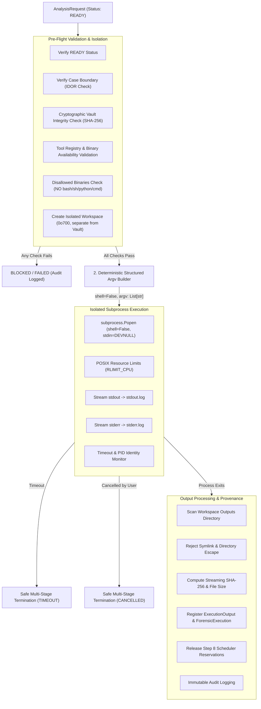

# ADFIR — Phase 2 / Step 9: Secure Forensic Execution Subsystem

## 1. Overview & Objective

The **Secure Forensic Execution Subsystem** executes ONLY `READY` analysis requests released by the **Step 8 Resource-Aware Scheduler**, subjecting every process invocation to forensic controls and security containment.

> [!IMPORTANT]
> **Strict Architectural Invariants Enforced**:
> 1. **READY-Only Execution**: Only analysis requests released and prioritized by Step 8 can be started.
> 2. **Zero Shell Execution**: Subprocesses are spawned strictly with `shell=False`. Shell command strings are NEVER constructed.
> 3. **Disallowed Shell Binaries**: `bash`, `sh`, `zsh`, `cmd`, `powershell`, `python`, `sudo`, and scripting interpreters are banned via `DISALLOWED_BINARIES`.
> 4. **Pre-Execution Integrity Verification**: Every evidence item undergoes full streaming SHA-256 re-hashing against its vault record before execution starts.
> 5. **Dedicated Workspace Isolation**: Every execution operates inside a private directory (`workspaces/{case_id}/{execution_id}`) with `0o700` permissions. The workspace cannot collide with or modify the evidence vault.
> 6. **Authoritative PID Identity**: Process termination verifies the authoritative creation timestamp (`get_process_start_time`) to prevent PID recycling race conditions.
> 7. **Zero Original Evidence Mutation**: Evidence files are accessed read-only; output files are captured inside the isolated workspace.

---

## 2. Data Model & State Machine

### Tables Implemented (Alembic Migration `008_secure_execution_schema.py`)

#### 1. `forensic_executions`
Persists complete provenance for every tool invocation:
- `id` (UUID PK): Unique execution identifier.
- `request_id` (FK `analysis_requests.id`): Originating analysis request.
- `case_id` (FK `cases.id`): Case boundary container.
- `plan_id` / `task_id` / `task_key`: Plan and task coordinates.
- `evidence_id` (FK `evidence_items.id`): Target evidence artifact.
- `tool_id` / `tool_version` / `executable_path`: Concrete tool binary executed.
- `validated_argv` (JSON): Sanitized list of arguments executed.
- `host_platform` / `host_architecture`: Execution environment (e.g. `linux`, `x86_64`).
- `workspace_path`: Path to private workspace directory.
- `resource_allocation`: CPU, RAM, and disk quotas granted by Step 8.
- `timeout_seconds`: Execution deadline.
- `execution_status`: `STARTING`, `RUNNING`, `COMPLETED`, `FAILED`, `TIMEOUT`, `CANCELLED`, `RESOURCE_LIMIT`, `BLOCKED`.
- `exit_code`: Subprocess return code.
- `pid` / `process_start_time`: Process identifiers.
- `stdout_path` / `stderr_path`: Captured log artifact references.
- `started_at` / `completed_at` / `duration_seconds`: High-precision timing.
- `cancellation_reason` / `failure_reason`: Diagnostic termination details.
- `output_count`: Number of verified output artifacts registered.

#### 2. `execution_outputs`
Tracks every artifact produced inside the workspace:
- `id` (UUID PK): Output artifact ID.
- `execution_id` (FK `forensic_executions.id`): Execution that created it.
- `request_id` / `case_id` / `evidence_id`: Provenance relationships.
- `filename` / `relative_path` / `storage_path`: Output location.
- `size_bytes`: File size.
- `sha256_hash`: Cryptographic SHA-256 hash.
- `mime_type`: Detected MIME type.
- `metadata_json`: Creation timestamps and extension metadata.

---

## 3. Subsystem Architecture

### 1. Pre-Flight Security Gate
- **Request State Check**: Rejects any request not in `READY` status.
- **Evidence Integrity Gate**: Re-hashes vault file via streaming 8 MiB reads (`calculate_sha256`). If hash differs from stored record:
  - Evidence integrity status is locked to `FAILED`.
  - A `ChainOfCustodyEvent` (`INTEGRITY_VIOLATION`) is appended.
  - An `AuditEvent` (`EXECUTION_INTEGRITY_FAILED`) is logged.
  - Execution is immediately rejected.
- **Tool Availability & Safety**:
  - Binary must exist, be executable (`os.access(..., os.X_OK)`), and not be disabled.
  - Rejects binaries in `DISALLOWED_BINARIES`.
  - Rejects shell metacharacters and path traversals in tool paths.

### 2. Workspace Isolation
- Creates `settings.DATA_DIR / "workspaces" / {case_id} / {execution_id}`.
- Enforces `0o700` permissions on POSIX.
- Invariant: Workspace cannot reside inside or share paths with `settings.EVIDENCE_DIR`.

### 3. Safe Argv Construction
- Uses strictly `List[str]` for `argv`. Never shell strings or `shell=True`.
- Rejects any argument containing null bytes `\0`, newlines `\n`, or shell characters: `;`, `|`, `&`, `>`, `<`, `` ` ``, `$()`.
- Maps structured parameters to tool-specific CLI parameters safely.

### 4. Bounded Output Streaming
- Writes stdout to `stdout.log` and stderr to `stderr.log` inside the workspace.
- Enforces 50 MB log file limits to protect host disk capacity.
- Buffers preview data (first 64 KB) in memory for instant API status returns.

### 5. Process Monitoring & Authoritative Termination
- Continuously polls process state and compares elapsed time against `timeout_seconds`.
- Safe multi-stage termination on timeout or cancellation:
  1. Verifies authoritative creation timestamp `get_process_start_time(pid)`.
  2. Sends `SIGTERM` / `proc.terminate()`.
  3. Waits up to 1.5 seconds.
  4. If alive and PID identity still matches, sends `SIGKILL` / `proc.kill()`.

### 6. Output Discovery & Hashing
- Scans `workspace / "outputs"` and workspace root for produced files.
- Verifies workspace containment; rejects symlinks pointing outside.
- Calculates streaming SHA-256 hash and size in bytes.
- Registers `ExecutionOutput` in database and logs audit events.

### 7. Step 8 Scheduler Synchronization
- On start: transitions `AnalysisRequest.scheduler_status` to `RUNNING`.
- On completion: transitions to `COMPLETED`, releases resource reservations (`allocated_resources = {}`).
- On failure/timeout/cancellation: transitions to `FAILED`, `TIMEOUT`, or `CANCELLED`, and releases reservations.

---

## 4. REST API Reference

All endpoints enforce case membership verification and IDOR protection.

| Method | Path | Description |
|---|---|---|
| `POST` | `/api/v1/executions/requests/{request_id}/start` | Launch execution of a READY analysis request (`wait=true` optional) |
| `GET` | `/api/v1/executions/{execution_id}` | Retrieve execution details, argv, timing, and provenance |
| `GET` | `/api/v1/executions/{execution_id}/status` | Lightweight status polling (status, exit code, duration, outputs) |
| `GET` | `/api/v1/executions/{execution_id}/outputs` | List verified output artifacts with SHA-256 hashes and sizes |
| `GET` | `/api/v1/executions/{execution_id}/stdout` | Retrieve captured standard output stream (bounded) |
| `GET` | `/api/v1/executions/{execution_id}/stderr` | Retrieve captured standard error stream (bounded) |
| `POST` | `/api/v1/executions/{execution_id}/cancel` | Safely abort an actively running execution |
| `GET` | `/api/v1/cases/{case_id}/executions` | List all executions conducted within a case |

---

## 5. Test Verification

Implemented in [`backend/tests/test_secure_execution_subsystem.py`](file:///home/nandireddy/ADFIR/backend/tests/test_secure_execution_subsystem.py):
- **18 / 18 Tests Passed (100%)**:
  1. `test_ready_only_execution_rejection`: Rejection of non-READY states.
  2. `test_invalid_request_or_missing_evidence`: Rejection of invalid inputs.
  3. `test_evidence_cross_case_idor_rejection`: Rejection of cross-case tampering.
  4. `test_evidence_vault_integrity_verification_success`: Cryptographic integrity check pass.
  5. `test_evidence_vault_integrity_tamper_blocked`: Tamper detection, locking to FAILED, custody violation logging.
  6. `test_disabled_or_unavailable_tool_rejection`: Disabled tool rejection.
  7. `test_disallowed_binary_rejection`: Banned shell/scripting binary blocking.
  8. `test_workspace_isolation_and_permissions`: Private directory, separation from vault, 0o700 permissions.
  9. `test_path_traversal_and_null_byte_rejection`: Input validation bounds check.
  10. `test_symlink_escape_rejection`: Symlink escape detection during output harvesting.
  11. `test_argv_only_shell_false_execution`: List argv construction and shell character rejection.
  12. `test_successful_execution_and_output_hashing`: Output discovery, SHA-256 calculation, and DB registration.
  13. `test_non_zero_exit_code_marks_failed`: Non-zero exit code recorded as FAILED.
  14. `test_timeout_monitoring_and_resource_release`: Timeout enforcement and scheduler cleanup.
  15. `test_cancellation_and_resource_release`: Process cancellation and PID identity verification.
  16. `test_stdout_and_stderr_capture`: Separate stdout/stderr stream preservation.
  17. `test_execution_provenance_and_audit_logging`: Complete provenance and audit logging.
  18. `test_case_authorization_and_idor_isolation`: 403 Forbidden enforcement on unauthorized cross-case access.

**Test Executables Used**: Completely harmless POSIX executables (`sha256sum`, non-destructive test scripts performing harmless `echo` / `sleep`, `true`, `false`). Zero destructive commands.
