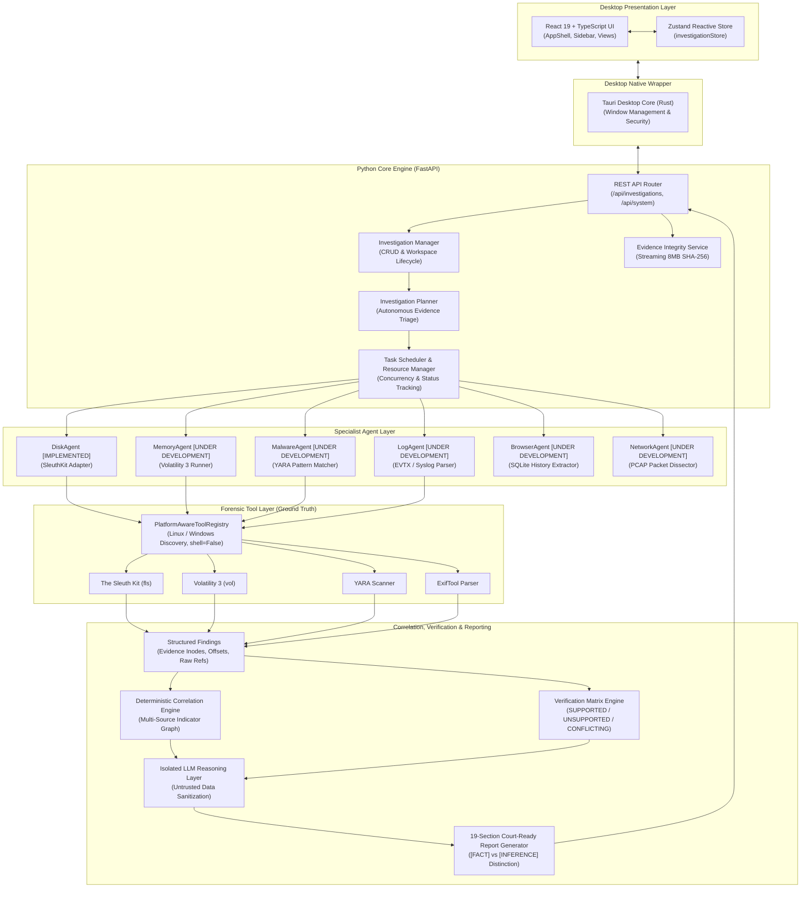

# ADFIR Conceptual System Architecture

This document specifies the end-to-end dataflow and component architecture of the ADFIR platform.

---

## Agent Implementation Matrix

| Agent | Current Implementation Status | Backing Forensic Engine / Tool |
| :--- | :---: | :--- |
| **`BaseAgent`** | **IMPLEMENTED** | Abstract Base Class contract (`can_handle`, `plan`, `analyze`, `validate`) |
| **`DiskAgent`** | **IMPLEMENTED** | The Sleuth Kit (`fls`) filesystem directory tree parser |
| **`PlannerAgent`** | **IMPLEMENTED** | `InvestigationPlanner` deterministic triage service |
| **`CorrelationAgent`** | **IMPLEMENTED** | `CorrelationEngine` entity clustering service |
| **`VerificationAgent`** | **IMPLEMENTED** | `VerificationEngine` provenance scoring service |
| **`ReportAgent`** | **IMPLEMENTED** | `ReportGenerator` 19-section Markdown synthesis service |
| **`MemoryAgent`** | **UNDER DEVELOPMENT** | Volatility 3 (`vol`) memory dump introspection plugins |
| **`MalwareAgent`** | **UNDER DEVELOPMENT** | YARA (`yara`) signature matcher and rule bank |
| **`LogAgent`** | **UNDER DEVELOPMENT** | Windows Event Log (`.evtx`) security parser |
| **`BrowserAgent`** | **UNDER DEVELOPMENT** | SQLite browser history and cookie parser |
| **`NetworkAgent`** | **UNDER DEVELOPMENT** | PCAP packet dissector and flow reconstructor |
